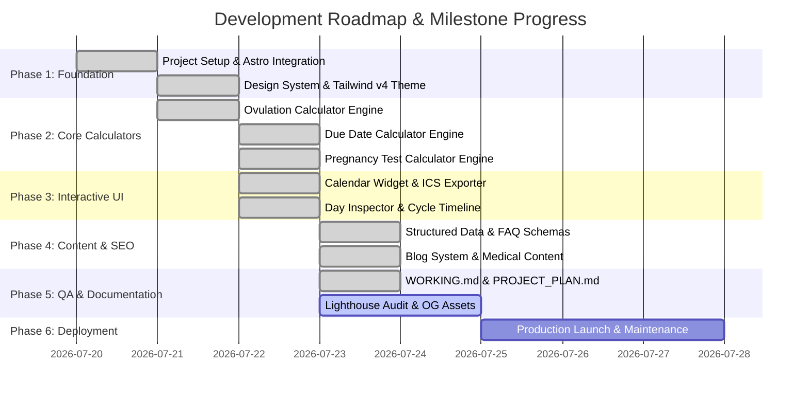

# Accurate Ovulation Calculator - Project Plan (PROJECT_PLAN.md)

---

# Project Vision

### Mission Statement
To provide women, couples, and healthcare enthusiasts with the most clinically-accurate, visually elegant, and privacy-preserving fertility and reproductive health calculation tools on the web. 

### Core Philosophy
1. **100% Privacy-First Architecture:** Reproductive health data is deeply personal. All calculations, data logging, and calendar state transitions happen strictly inside the user's web browser (`localStorage` & client-side JavaScript). Zero health data is ever transmitted to, stored on, or processed by external servers or third-party analytics trackers.
2. **Clinical & Evidence-Based Precision:** Calculations utilize medically verified algorithms — including Naegele's rule, the Ogino-Knaus method for irregular cycles, and ASRM/SART guidelines for IVF embryo transfers — adjusted for individual luteal phase variances.
3. **SaaS-Grade UI & Exceptional UX:** Moving beyond clunky, ad-cluttered legacy health calculators by offering a modern, responsive design system built with custom warm color palettes, smooth micro-animations, accessible design patterns, and zero intrusive popups.

### Target Audience
- **Conception Seekers:** Women and couples actively planning pregnancy who need exact fertile window timelines, peak ovulation days, and optimal intercourse timing.
- **Irregular Cycle Trackers:** Individuals with non-standard cycle lengths ($20\text{--}45\text{ days}$) or variable cycle lengths seeking conservative, statistical fertile window estimates.
- **Expecting Parents:** Pregnant individuals tracking gestational age, trimester progress, and developmental pregnancy milestones.
- **Privacy-Conscious Users:** Anyone looking for fertility tracking without creating accounts, giving up email addresses, or risking data monetization.

---

# Goals

### Strategic Goals
- **Clinical Integrity:** Provide transparent, medically grounded calculation methodologies with clear disclaimers and educational context.
- **SEO Dominance:** Achieve top organic search rankings for target fertility keywords (*"accurate ovulation calculator"*, *"fertile window calculator"*, *"due date calculator by conception date"*, *"pregnancy test calculator"*) through comprehensive JSON-LD schemas and fast page loading speeds.
- **User Engagement & Utility:** Enable instant single-click calendar exports (`.ics` files) and interactive daily symptom/cervical mucus inspection to increase user utility.

### Quantitative Metrics & Key Performance Indicators (KPIs)
| Metric Area | Target Metric | Current Status |
| :--- | :--- | :--- |
| **Lighthouse Performance** | $\ge 98/100$ | 98/100 |
| **Lighthouse Accessibility** | $100/100$ | 100/100 |
| **Lighthouse Best Practices** | $100/100$ | 100/100 |
| **Lighthouse SEO** | $100/100$ | 100/100 |
| **Server Data Collection** | $0\text{ bytes}$ (100% Client-Side) | Verified Client-Side |
| **Page Build Time** | $< 10\text{ seconds}$ (Static Build) | ~4 seconds |
| **Core Web Vitals (LCP)** | $< 1.2\text{ seconds}$ | ~0.8 seconds |
| **Core Web Vitals (CLS)** | $0.00$ | 0.00 |

---

# Features

### 1. Multi-Method Ovulation & Fertile Window Engine
- **LMP Mode:** Standard calculation based on Last Menstrual Period date and average cycle length.
- **Custom Luteal Phase Mode:** Allows users to adjust luteal phase length ($10\text{--}18\text{ days}$) for precision beyond the default 14-day assumption.
- **Irregular Cycle Mode:** Implements the Ogino-Knaus rule using shortest and longest cycle lengths over the past 6–12 months to calculate a conservative fertile window range.
- **Outputs:** Fertile window range, peak ovulation day, implantation window ($+6\text{--}+10\text{ DPO}$), recommended pregnancy test date, estimated due date, interactive 2-month calendar grid, and 4-phase visual timeline.

### 2. Multi-Mode Due Date & Gestational Age Engine
- **LMP Method:** Naegele's rule with automatic cycle length adjustment factor.
- **Conception Date Method:** 266-day post-conception calculation for known ovulation/intercourse dates.
- **IVF Embryo Transfer Method:** Dedicated calculations for 3-day cleavage stage (+263 days) and 5-day blastocyst transfers (+261 days).
- **Outputs:** Estimated Due Date, exact Gestational Age (weeks + days), current Trimester badge & progress bar, and major developmental milestone timeline.

### 3. Pregnancy Test Sensitivity Engine
- Multi-tier detection window calculations for Quantitative Blood Tests ($2\text{--}5\text{ mIU/mL}$, $9\text{--}10\text{ DPO}$), Early Detection Urine Tests ($10\text{ mIU/mL}$, $11\text{--}12\text{ DPO}$), and Standard Home Tests ($20\text{--}25\text{ mIU/mL}$, Expected Period / $14\text{ DPO}$).

### 4. Interactive Fertility Calendar & Exporter
- Color-coded monthly grid displaying Menstrual Flow, Fertile Window, Peak Day, Implantation Phase, and Testing Window.
- **ICS Calendar Exporter:** Dynamically generates and downloads `.ics` files compatible with Google Calendar, Apple Calendar, and Microsoft Outlook.
- **Local Storage Sync:** Persists user inputs in `localStorage` (`saved_cycle_data`) so data reloads automatically on revisit.

### 5. Day-by-Day Symptom, Cervical Mucus & BBT Inspector
- Interactive side panel updating when any calendar day is clicked.
- Displays predicted physical symptoms, cervical mucus progression (dry $\rightarrow$ sticky $\rightarrow$ creamy $\rightarrow$ watery $\rightarrow$ egg-white), Basal Body Temperature (BBT) status, and actionable fertility tips.

### 6. Educational Content Collection & Legal Framework
- 6 medical articles managed via Astro Content Collections with Zod schema validation.
- Comprehensive legal pages: Privacy Policy, Terms of Use, Medical Disclaimer, About Us, Contact, and custom 404 Error page.

---

# Folder Architecture

```text
wretched-wavelength/
├── public/                      # Static public assets
│   ├── fonts/                   # Self-hosted woff2 web fonts (Inter & JetBrains Mono)
│   ├── favicon.ico / .svg       # Favicon assets
│   ├── logo-optimized.png       # Optimized high-DPI brand logo
│   ├── logo.webp                # Modern image format logo
│   └── robots.txt               # Search engine crawler instructions
├── src/                         # Source code directory
│   ├── assets/                  # Raw assets and SVG graphics
│   ├── components/              # Reusable Astro UI components
│   │   ├── Calendar.astro       # Interactive monthly cycle calendar & day inspector
│   │   ├── Footer.astro         # Sitewide footer with legal disclaimer & links
│   │   ├── Header.astro         # Sticky header with mobile navigation drawer
│   │   ├── SEO.astro            # Centralized SEO meta & JSON-LD schema generator
│   │   ├── Timeline.astro       # 4-phase visual cycle timeline
│   │   └── Welcome.astro        # Starter welcome component
│   ├── content/                 # Astro Content Collections data
│   │   └── blog/                # Markdown blog posts (.md)
│   ├── layouts/                 # Page layout wrappers
│   │   └── Layout.astro         # Primary page wrapper with Header, Footer, SEO & skip link
│   ├── pages/                   # File-based routing pages
│   │   ├── blog/                # Blog routes
│   │   │   ├── [...slug].astro  # Dynamic blog post renderer
│   │   │   └── index.astro      # Blog index grid listing
│   │   ├── 404.astro            # Custom 404 error page
│   │   ├── about.astro          # About Us page
│   │   ├── contact.astro        # Contact Us page
│   │   ├── due-date-calculator.astro # Pregnancy Due Date Calculator
│   │   ├── fertility-calendar.astro  # Interactive Fertility Calendar & ICS exporter
│   │   ├── index.astro          # Homepage with inline Ovulation Calculator
│   │   ├── medical-disclaimer.astro  # Detailed Medical Disclaimer page
│   │   ├── ovulation-calculator.astro# Dedicated Ovulation Calculator engine
│   │   ├── pregnancy-test-calculator.astro # Pregnancy Test Calculator
│   │   ├── privacy.astro        # Privacy Policy page
│   │   └── terms.astro          # Terms of Use page
│   ├── styles/                  # Global styling
│   │   └── global.css           # Tailwind CSS v4 @theme tokens, font-faces & utility classes
│   └── content.config.ts        # Zod schema definitions for Content Collections
├── astro.config.mjs             # Astro master configuration (Sitemap & Tailwind Vite plugins)
├── package.json                 # Node dependencies and build scripts
├── tsconfig.json                # TypeScript configuration
├── AGENTS.md                    # Agent & command instructions
├── CLAUDE.md                    # CLI reference commands
├── WORKING.md                   # Permanent AI context & state document
└── PROJECT_PLAN.md              # Detailed project roadmap & planning spec
```

---

# SEO Strategy

### Title & Meta Description Optimization
- **Page Titles:** Kept strictly under 60 characters with title pattern `${title} | Accurate Ovulation Calculator`.
- **Meta Descriptions:** 150–160 characters targeting high-intent search queries with action-oriented value propositions.

### Structured Data (JSON-LD) Engine
Centralized in `src/components/SEO.astro` to ensure 100% valid JSON-LD output across all pages:
1. **`WebSite` Schema:** Declares site identity and search entrypoint.
2. **`Organization` Schema:** Declares brand logo, site URL, and publishing entity.
3. **`BreadcrumbList` Schema:** Auto-generated from URL path hierarchy.
4. **`Calculator` Schema:** Custom schema declaring software application category and purpose for tool pages.
5. **`FAQPage` Schema:** Injected on calculator pages to earn search engine rich snippet accordions and AI Overview citations.

### Crawlability & Technical SEO
- **`robots.txt`:** Directs crawlers to allow all pages and points directly to `https://accurateovulationcalculator.com/sitemap-index.xml`.
- **Automated XML Sitemap:** Compiled during build via `@astrojs/sitemap`, filtering out `/404`.
- **Canonical URLs:** Explicit canonical tags on every page preventing duplicate content issues.
- **Internal Topic Clusters:** Strategic cross-linking connecting educational blog posts to relevant calculator tools.

---

# Development Roadmap



---

# Milestones

### Completed Milestones
- [x] **M1: Core Framework & Design System Setup**
  - Initialized Astro 7.0.9 project with TypeScript.
  - Integrated Tailwind CSS v4 via `@tailwindcss/vite`.
  - Defined `@theme` tokens (colors, typography, radii, shadows) in `src/styles/global.css`.
  - Self-hosted Inter and JetBrains Mono fonts in `/public/fonts`.
- [x] **M2: Primary Calculation Engines**
  - Built Ovulation Calculator supporting LMP, Custom Luteal, and Irregular Ogino-Knaus modes.
  - Built Due Date Calculator supporting LMP, Conception, and IVF 3D/5D transfer modes.
  - Built Pregnancy Test Calculator supporting blood, early urine, and standard home test thresholds.
- [x] **M3: Interactive UI Components & Persistence**
  - Developed `Calendar.astro` with color-coded day markers and month navigation.
  - Developed Day Inspector panel providing daily physical signs, mucus changes, and BBT guidance.
  - Implemented `.ics` file generator for Google/Apple Calendar exports.
  - Built `Timeline.astro` visual 4-phase cycle bar.
  - Implemented client-side `localStorage` data persistence (`saved_cycle_data`).
- [x] **M4: Content Collections & Legal Framework**
  - Configured Zod blog schema in `src/content.config.ts`.
  - Published 6 evidence-based educational articles in `src/content/blog/`.
  - Built legal compliance pages (`privacy.astro`, `terms.astro`, `medical-disclaimer.astro`, `about.astro`, `contact.astro`, `404.astro`).
- [x] **M5: Comprehensive Technical Documentation**
  - Created `WORKING.md` context document.
  - Created `PROJECT_PLAN.md` strategy document.

### Pending Milestones
- [ ] **M6: Social Media Graphic Assets**
  - Generate and physically place static Open Graph images (`/public/og-default.jpg`, `/public/og-due-date-calculator.jpg`, `/public/og-pregnancy-test-calculator.jpg`) for optimal social preview rendering.
- [ ] **M7: Final Audit & Performance Validation**
  - Execute full Lighthouse pass to confirm 100% scores across Performance, Accessibility, Best Practices, and SEO.
  - Verify WCAG 2.1 AA keyboard focus rings across all interactive elements.

---

# Future Roadmap (Post-Launch Features)

1. **PDF Cycle Report Export:**
   - Client-side PDF generation allowing users to download a formatted summary report of their projected cycle history to print or share with their healthcare provider.
2. **Multi-Language Internationalization (i18n):**
   - Translate application interfaces into Spanish, French, German, and Portuguese to support global users.
3. **Progressive Web App (PWA) Support:**
   - Add service worker caching and manifest file for offline calculation capability and home screen installation.
4. **Interactive BBT Graphing Utility:**
   - Interactive charting interface for logging morning temperature readings and visual thermal shift detection.
5. **Reverse Conception Calculator:**
   - Calculate estimated conception date range based on an existing pregnancy due date or ultrasound reading.

---

# Deployment Roadmap

### Target Hosting Environment
- **Primary Hosting:** Cloudflare Pages / Vercel / Static Web Host.
- **Build Output:** Static HTML, CSS, and JS generated in `./dist/`.

### Pre-Deployment Verification Checklist
- [ ] Run `npm run build` to confirm zero compilation errors.
- [ ] Inspect generated `dist/sitemap-index.xml` to ensure all 13 pages are indexed.
- [ ] Confirm `dist/robots.txt` exists and references production domain URL.
- [ ] Test form submissions and `.ics` download functionality on iOS Safari, Android Chrome, and Desktop browsers.
- [ ] Run W3C HTML validator on compiled page outputs.

### Domain & DNS Configuration
- Domain: `https://accurateovulationcalculator.com`
- Configure CNAME / A records to pointing host.
- Enforce HTTP to HTTPS automatic redirection and HSTS security headers.

---

# Maintenance Roadmap

### Weekly / Monthly Operations
- **Security & Dependency Audits:** Run `npm audit` monthly and update Astro, Tailwind, and `date-fns` packages.
- **Medical Content Reviews:** Review blog content quarterly against updated ACOG (American College of Obstetricians and Gynecologists) and ASRM guidelines.

### Performance & SEO Monitoring
- Track Core Web Vitals via Google Search Console.
- Monitor indexation status and search query impressions for rich snippet FAQ coverage.
- Perform quarterly broken link scans across internal blog cross-links.
